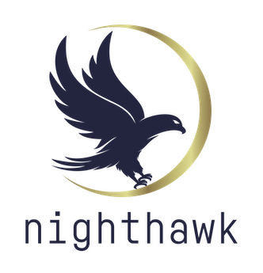

Ansible Nighthawk (Docker)
=========
[](https://github.com/warhorse/ansible-role-nighthawk-docker/actions?query=workflow%3ACI)
[](https://galaxy.ansible.com/warhorse/nighthawk_docker)
[](https://galaxy.ansible.com/warhorse/nighthawk_docker)
[](https://galaxy.ansible.com/warhorse/nighthawk_docker)





Install Nighthawk (Docker)

This role is part of the Warhorse Automation Framework. This role can be used with Warhorse or as a standalone role.

Docker Image
-------------

Built in docker image.

:warning: There is NO Nighthawk code in this git repository. You will need to give this role a zip file that contains the Nighthawk C2 code. You can buy Nighthawk at [MDSec](https://www.mdsec.co.uk/nighthawk/) :warning:

Role Variables
--------------

A list of all the variables can be found in ./defaults/main.yml.

`nighthawk_dir` - Nighthawk container directory 

`nighthawk_ports` - Nighthawk container ports

`nighthawk_hostname` - Nighthawk container hostname

`nighthawk_container_name` - Nighthawk container name 

`nighthawk_username` - Nighthawk username

`nighthawk_password` - Nighthawk password 

`nighthawk_campaign` - Nighthawk campaign name

`nighthawk_host` - Nighthawk host IP

`nighthawk_port` - Nighthawk API Service port

`nighthawk_zip` - Nighthawk source zip file

`nighthawk_docker_network` Nighthawk container docker network


Dependencies
------------

```shell
ansible-galaxy install geerlingguy.docker geerlingguy.pip
```

Install
------------

```shell
ansible-galaxy install warhorse.nighthawk_docker
```

Example Playbook
----------------

```yaml
- hosts: servers
  roles:
      - { role: warhorse.nighthawk_docker }
```

Example Vars
----------------

```yaml
nighthawk_hostname: "nighthawk"
nighthawk_container_name: "nighthawk"
nighthawk_username: "operator"
nighthawk_password: "password"
nighthawk_docker_labels: {}
nighthawk_docker_network: "nighthawk"
nighthawk_dir: '/opt/docker/nighthawk'
nighthawk_campaign: "campaign"
nighthawk_zip: "nighthawk.zip"
nighthawk_ports:
  - "127.0.0.1:8888:8888"
  - "0.0.0.0:443:443"
  - "0.0.0.0:80:80"
```

License
-------

MIT/BSD

Author Information
------------------

Ralph May
